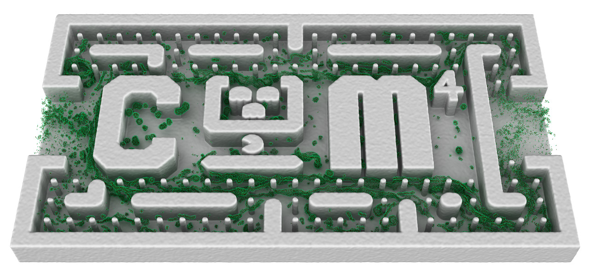
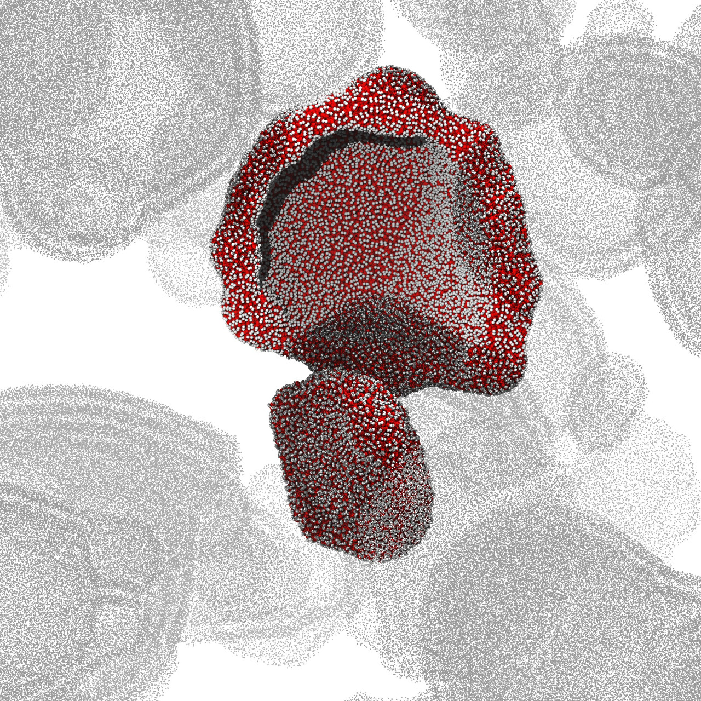

# MESO
The <sub><i>USER</i></sub>**MESO** package of LAMMPS is a fully GPU-accelerated package for Dissipative Particle Dynamics. Instead of being merely a translation of the conventional molecular dynamics, the package integrates several innovations that specifically targets CUDA devices

  * atomics-free warp-synchronous neighbor list construction algorithm;
  * 2-level particle reordering which aligns with the cell list lattice boundaries for generating strictly monotonic neighbor list
  * locally transposed neighbor list;
  * redesigned non-branching transcendental functions (sin, cos, pow, log, exp, etc.);
  * overlapped pairwise force evaluation and halo exchange using CUDA streams for hiding communication and kernel launch latency;
  * radix sort with GPU stream support;
  * pairwise random number generation based on per-timestep binary particle signatures and the Tiny Encryption Algorithm;

It can achieve tens of times speedup on a single CUDA GPU over 8-16 CPU cores. The work is featured by a NVIDIA Parallel Forall blog article [Accelerating Dissipative Particle Dynamics Simulation on Tesla GPUs](https://devblogs.nvidia.com/parallelforall/accelerating-dissipative-particle-dynamics-simulation-tesla-gpus/).

# License
The package can be freely used and redistributed under the GPL v3 license. However we would greatly appreciate if you could cite the following paper:<br/>
Tang, Yu-Hang, and George Em Karniadakis. "Accelerating dissipative particle dynamics simulations on GPUs: Algorithms, numerics and applications." *Computer Physics Communications* 185.11 (**2014**): 2809-2822.

# Compilation Guide
NVCC and a MPI implementation is required for compilation of the code.
```
cd <working_copy>/src
make yes-molecule
make yes-user-meso
make meso ARCH=[sm_30|sm_35|sm_52|sm_60|...]
```
To run a simple example of DPD fluid
```
cd <working_copy>/example/simple
../../src/lmp_meso -in [sp.run|dp.run] -var case [25|48|64]
```
```
sp.run: single-precision
dp.run: double-precison
case: simulation box size (number density = 4)
```

# Example simulations

| Amphiphilic polymers in microfluidic channel |
|:---------------------------------:|
|  |

| Membrane wrapping into a vesicle     |  Multi-layer vesicle                   |
|:------------------------------------:|:--------------------------------------:|
|  |   |
